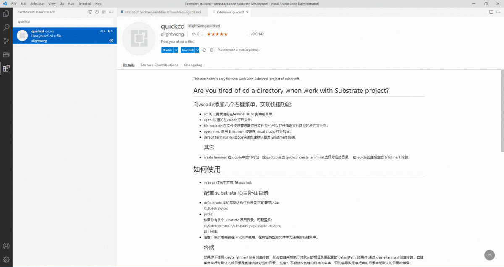

This extension is only for who work with Substrate project of micorsoft.

# Are you tired of cd a directory when work with Substrate project?
**你知道这个名字 Entities.OnlineMeetings.dll:**
- 怎么更快速的cd到该dll的目录？
- 打开对应的csproj文件？
- 使用 Enlistment 在visualstudio在打开？
- 浏览所在的文件夹?

**本扩展，只需要点两下鼠标就能实现你想要的！！**

## 向vscode添加几个右键菜单，实现快捷功能:
- cd: 可以更便捷的在terminal 中 cd 到当前目录.   
- open: 快捷的在vscode打开文件.   
- file explorer: 在文件资源管理器打开文件夹.也可以打开指定文件路径的所在文件夹。   
- open in vs: 使用 Enlistment 终端在 visual studio 打开项目.
- default terminal: 在vscode快捷创建默认目录 Enlistment 终端. 
- create terminal: 在vscode中按F1呼出，搜quickcd,点击 quickcd: create ternminal,选择对应的目录， 在vscode创建指定的 Enlistment 终端.
- 注意：右键菜单需要在 .md文件使用，在其它类型的文件中无法看到右键菜单。
# 如何使用
- vs code 订阅本扩展, 搜 quickcd.
## 配置 substrate 项目所在目录
- defaultPath:
本扩展默认需要的目录,可配置成，比如：  
C:\Substrate\src   
src是substrate项目的根目录。
- paths:  
 如果你有多个 substrate 项目目录，可配置成：   
 C:\Substrate\src;C:\Substrate1\src;C:\Substrate2\src   
 以 ; 分隔.
## 终端
如果你不使用 create termianl 命令创建终端并使该终端处于活动状态，那么右键菜单执行时默认的根目录是配置的 defaultPath. 
如果你通过 create termianl 创建终端，右键菜单执行时默认的根目录是创建终端对应的目录。
注意：不能修改创建的终端的名字，否则会导致程序把当前目录当成默认的目录的错误。
## 第一次使用
当第一次使用时，会在你substrate 项目目录的 src 文件夹所在的目录生成 vs-manifest.json 文件。  
如果想手动添加 .csproj 文件所在目录，可在 vs-manifest.json 文件添加。   

## 路径感知
- 根据光标所在的位置（闪烁），根据上下文件自动感知出要执行的目录或文件，如果你手动选择一段文本，自动感知不起作用。
- 比如
  /sources/dev/common/src/Net/AadClient/Microsoft.Exchange.Net.AadClient.csproj Internal.Exchange.Test.Services.OData.MobileDeviceTests.TestCloudMdm，
光标定位在/sources/dev/common/src/Net/AadClient/Microsoft.Exchange.Net.AadClient.csproj的任意位置，会自动感知到
/sources/dev/common/src/Net/AadClient/Microsoft.Exchange.Net.AadClient.csproj
将之视为将要执行命令的路径（根据空格判断）。 你手动选择这个路径具有同样的效果。

## 举例：sources/dev/common/src/Net/
扩展将和你终端所在路径拼接成物理路径，假如终端对应的路径是 C:\Substrate\src. 拼接后的就是 C:\Substrate\src/sources/dev/common/src/Net/.
可以右键菜单：
- cd.
- file explorer.
## 举例：Microsoft.Exchange.Net.AadClient.csproj
扫描生成的 vs-manifest.json 找到其对应的物理路径。
可执行的右键菜单：
- cd.
- file explorer.
- open.
- open in vs: 在visual studio 打开项目.
## Microsoft.Exchange.Net.AadClient.dll
扩展会将以.dll结尾的文件理解成.csproj文件。   

- 此外，可以识别 vs-manifest.json 没有但本地刚刚 produce 的core项目。

## 可以自动识别如下各种路径，慢慢探索吧。
/sources/dev/common/src/Net/AadClient/Microsoft.Exchange.Net.AadClient.csproj 
Microsoft.Exchange.Net.AadClient.csproj
Microsoft.Exchange.Net.AadClient.dll  
sources\dev\common\src\Net\AadClient\AADGroup.cs
sources/dev/common/src/Net/
- 还可以自动排除要识别前、后的干扰文本：直接识别到：Microsoft.Exchange.Net.AadClient.csproj
asdasdas Microsoft.Exchange.Net.AadClient.csproj asdasdwa      

## 其它智能提示
Microsoft.Exchange.Entities.OnlineMeetings.dll 
比如这个dll，找不到对应的项目文件名是，会提示你哪些文件名和它比较像。

# Links
* [Marketplace](https://marketplace.visualstudio.com/items?itemName=alightwang.quickcd)
* [Source Code](https://github.com/wzengguang/quickOpenFile)

# License
[Apache](https://github.com/emeraldwalk/vscode-runonsave/blob/master/LICENSE)